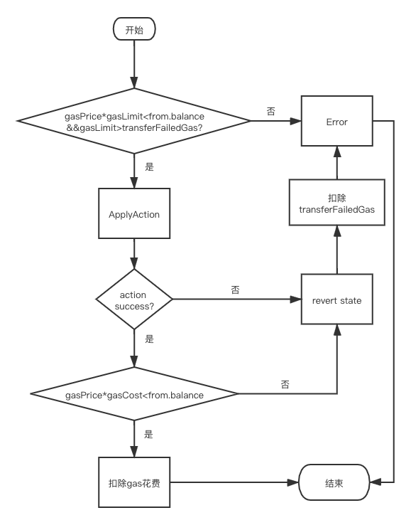

# Damoclis 智能合约开发文档

[TOC]


## 快速入门

### 安装

从Github拉取一份合约项目模板：

```shell
git clone https://github.com/damoclis/dmc-smart-contract-boilerplate
```

进入项目目录，安装依赖库：

```shell
npm install
```

全局安装dmcscript：

```shell
npm install dmcscript -g
```


### 编写Hello World合约

在`src`下，创建`helloworld`目录，并在该合约目录下新建一个合约文件`helloworld.ts`。

编写一个简单的Hello World合约，示例如下:

```typescript
import { Contract } from "dmc-lib";

class HelloWorld extends Contract {
  // 定义合约方法`hi`
  @action
  hi(msg: string): void {
    // 打印日志
    Prints(msg);
  }
}
```

在上面的例子中，我们自定义了一个合约类`HelloWorld`，继承自内置合约类`Contract`。同时，声明了一个合约方法`hi(msg:string):void`。所有的合约方法均需要使用装饰器`@action`来声明，编译器将会解析并导出对应的abi。

`Prints`是内置API，作用是在运行节点的终端打印相关信息。

### 编译与部署

下面，我们使用dmcscript编译合约:

```shell
dsc src/helloworld/helloworld.ts  
  -o build/helloworld/helloworld.wasm 
  -t build/helloworld/helloworld.wat 
  --abi build/helloworld/helloworld.abi
```

- `wasm`为合约的字节码文件，用于部署到区块链上。
- `wat`为合约字节码的文本描述文件。
- `abi`为合约的abi文件，用于部署到区块链上。

TODO 部署

### 资产查询与转移

我们尝试为上面的HelloWorld合约添加更丰富的功能，实现一个资产转移的例子：

```typescript
import { Contract, RequireAuth, Prints, Address, Asset } from "dmc-lib";

class HelloWorld extends Contract {
  // 定义合约方法`hi`
  @action
  hi(msg: string): void {
  	// 打印日志
  	Prints(msg);
  }
  
  // 定义合约方法`transfer`
  @action
  transfer(from: Address, to: Address, val: Asset): void{
  	// 判断当前合约发送方地址是否与`from`参数一致
  	RequireAuth(from);
  	// 从`from`向`to`转移资产`val`
  	from.transfer(to, val);
  }
}
```

上面我们定义了一个`transfer`合约方法，用于将数值为`val`的资产从`from`转移到`to`。 

这里我们涉及了两个重要的内置类型：

- `Address`: 地址类型，用于表示账户地址并提供相关方法。
- `Asset`: 资产类型，用于表示原生资产并提供相关方法。

`RequireAuth(addr: Address)`常用于判断操作的权限，若**入参地址与本次合约调用的发送方不一致**，则会终止合约执行。类似API还有`hasAuth(addr: Address): bool`，但它返回`bool`值，不会终止合约执行。例如，`Bob`发送了一笔交易调用了`transfer`合约方法，若入参`from`的地址与`Bob`不一致，则`RequireAuth(from)`将失败，终止合约。

### 数据持久化

数据持久化是智能合约必不可少的功能。我们希望合约中对数据的持久化是显式调用的，并与传统的数据库交互方式类似。

首先我们定义一个数据表`Person`。它是数据持久化的基本单元：

```typescript
// 声明数据表person，定义每列数据的字段。底层为k-v型存储。
// 简单来说：在合约的数据表`person`中，存储若干数据格式为`Person`的记录。
@database("person")
class Person implements Serializable {
  @key
  name: string
  age: u32;
}
```

`Serializable`是内置的序列化接口，所有需要持久化的数据类均须声明实现该接口，但**无需开发者手动实现，编译器会帮助自动补全代码**。

在Damoclis中，合约层的数据库模型如下：

- Contract
	- table 1
		- data1
		- data2
		- ...
		- dataN
	- table 2
	- table 3
	- ...

`@database("person")`装饰器用于表明该数据类存储在`person`表内，编译器会识别并生成对应ABI。

`@key`装饰器用于表明该数据项的主键。数据库底层实际为kv存储，k为`@key`声明的主键，v为整个数据对象的序列化字符串。

然后，在合约类中添加下列方法：

```typescript
@action
store(): void {
	const person = new Person();
	person.name = "bob";
	person.age = 16;
	// 创建一个数据项实例
	// 第一个参数为数据库所在合约，第二个参数为数据表名称
	const db = new Database<Person>(this.receiver, "person");
	// 写操作只对合约本身的数据表生效
	db.store(person);
}
```

完整代码如下：

```typescript
import { Contract, Database } from "../../src/database";

// 声明数据表person的数据类
@database("person")
class Person implements Serializable {
  @key
  name: string
  age: u32;
}

class DBTest extends Contract {
  _db: Database<Person>

  constructor() {
  	 // 初始化数据库实例
    this._db = new Database<Person>(this.self, "person");
  }

  @action
  store(): void {
    const person = new Person();
    person.name = "bob";
    person.age = 16;
    // 创建一个数据项实例
    // 写操作只对合约本身的数据表生效
    this._db.store(person);
  }
}
```

### 返回值

Damoclis设计了返回值机制，将合约的运行结果返回给区块链，**并保存在交易回执中**。

```typescript
class ReturnTest extends Contract {
	// 定义add方法，返回一个u64类型的值。
	@action
	add(a: u64, b: 64): u64{
		return Safemath.add(a, b);
	}
}
```

对于合约方法return的类型，我们支持以下三种：

- 整数类型：`i32/i64`，`u32/u64`。
- 字符串类型： `string`。
- 拥有`bytes`成员变量的复杂类型。如`Bytes`,`Address`, `Asset`或其他自定义类型。 //目前暂时只支持内置类型的返回

返回值以Bytes数组的形式保存在交易回执中。其数据格式为：`| 1 byte flag | bytes |`。`flag == 0`表示bytes部分是普通的bytes或字符串；`flag == 1`表示bytes部分是整数的大端字节数组，可进行相应解码。


### 跨合约调用

跨合约调用也是智能合约的必备功能。在Damoclis中，对合约的调用是以`Action`为单元。下面是一个调用其他合约的例子：

```typescript
// contractA.ts

import { Contract, Action } from "dmc-lib";

class ContractA extends Contract {
	@action
	call(target: Address):void {
		// 构建需要发送的内联action
		const action = new Action(target, Asset.zero, "hi", [Builtin.fromString("hello")]);
		// 发送action，调用对方合约方法
		action.send();
	}
}

// contractB.ts

import { Contract, Prints } from "dmc-lib";

class ContractB extends Contract {
	@action
	hi(msg: string):void {
		Prints(msg);
	}
}
```

上面演示了`contractA.call`通过跨合约调用`ContractB.hi`的例子。这里我们提供了一个内置的`Action`类，用于表示一个`action`，其构造函数为`Action(对方合约地址，发送资产数量，合约方法，[参数, ...])`，详见`Action`一章。

`Builtin`是内置类型，用于创建可序列化的合约方法参数。**参数数组仅支持一层的数组嵌套**。详见`Action`一章。

#### 上下文变化

`Contract`类初始化时会为三个成员变量复制：

- `sender` - 交易发送方
- `contract` - 合约调用方
- `receiver` - 交易接收方

一次普通的交易调用合约，上述变量赋值按以下规则：

```
sender = 交易发送方
contract = receiver = ContractA的地址
```

在上面的例子中，跨合约调用将使对方合约的上下文更改如下：

```
sender = ContractA.sender
contract = ContractA的地址
receiver = ContractB的地址
```

## 核心概念

### 账户模型

在Damoclis中，所有账户的唯一标识是地址。地址由用户公钥取前20 Bytes生成。在合约中的权限检查本质上是比较地址是否一致。

### 交易结构

在Damoclis中，调用合约方法的最小单元是`Action`。**一笔交易中可包含多个`Action`**，执行中若有某个`Action`执行失败，则回滚整个交易。

在一笔交易执行中，可能会触发多个跨合约调用，我们称为`inline_action`。它们也被看做是正常的`Action`，并会在交易执行结束后，收集并保存在交易的`inlineActions`字段中（该字段不参与交易哈希值计算，故不会改变交易的id）。这么做使得所有对合约的变更操作都留下日志，方便日后的追溯。

### 代币单位

Damoclis中的原生代币dom，总量为100亿。它还有unit,munit,kunit三个单位，换算公式如下：

| Symbol | Value |
|:----:|:-----:|
| unit | 1 |
| kunit | $10^{3}$ unit |
| muint | $10^{6}$ unit |
| dom | $10^{8}$ unit |
| maximum | $10^{10}$ dom |
为了方便在合约中的使用，我们提供了`Asset`类，其构造函数提供两个入参：数量与单位。

```typescript
const a1 = new Asset(1000, UNIT);
const a2 = new Asset(1, KUNIT);

a1 == a2; // true
```


# dmc-lib文档

## Contract

### Contract类

为合约编译的入口，编写的合约必须继承Contract类。

#### 使用示例

```typescript
import {Contract} from "dmc-lib"
```

#### 类属性

sender: Address;

receiver: Address;

contract: Address;

actionName: string;

| get访问器           | 描述             |
| ------------------- | ---------------- |
| get self(): Address | 返回receiver字段 |

#### 主要类方法


## Action

### 方法

```typescript
HasAuth(addr: Address): bool
```

`HasAuth`方法用于确认该地址是否为合约的sender。

```
RequireAuth(addr: Address): void
```

和`HasAuth`方法类似，但如果该地址不是合约的sender，则直接抛出异常。

### Builtin类

Builtin类主要用于action中的payload等，方便数据的序列化传输。实现了Serializable接口。

#### 使用示例

```typescript
import {Builtin} from "dmc-lib"
```

#### 类属性

_val: DataStream;

| get访问器                    | 描述               |
| ---------------------------- | ------------------ |
| get datastream(): DataStream | 返回类属性中的_val |
| get bytesLen(): u32          | 返回_val的长度     |


#### 主要类方法

| 类方法                                       | 描述                              |
| -------------------------------------------- | --------------------------------- |
| constructor(val: DataStream)                 | 根据指定的DataStream创建Builtin类 |
| static fromI32(val: i32): Builtin            | 根据一个i32类型的值创建Builtin类  |
| static fromU32(val: u32): Builtin            | 根据一个u32类型的值创建Builtin类  |
| static fromI64(val: i64): Builtin            | 根据一个i64类型的值创建Builtin类  |
| static fromU64(val: u64): Builtin            | 同上...                           |
| static fromI8(val: i8): Builtin              |                                   |
| static fromU8(val: u8): Builtin              |                                   |
| static fromI16(val: i16): Builtin            |                                   |
| static fromU16(val: u16): Builtin            |                                   |
| static fromVari32(value: i32): Builtin       |                                   |
| static fromVaru32(val: u32): Builtin         |                                   |
| static fromAddress(addr: Address): Builtin   |                                   |
| static fromString(str: string): Builtin      |                                   |
| static fromBytes(bytes: Bytes): Builtin      |                                   |
| static fromHash160(bytes: Bytes): Builtin    |                                   |
| static fromHash256(bytes: Bytes): Builtin    |                                   |
| static fromHash512(bytes: Bytes): Builtin    |                                   |
| static fromArray(params: Builtin[]): Builtin |                                   |

注意：调用`fromArray`时，不支持嵌套的数组。

### Action类

Action类中主要包含调用action相关的方法。实现了Serializable接口。

#### 使用示例

```typescript
import {Action} from "dmc-lib"
```

#### 类属性

_to: Address;

_value: Asset;

_method: string;

_payload: Builtin[];

_extra: string;

#### 主要类方法

| 类方法                                                       | 描述                  |
| ------------------------------------------------------------ | --------------------- |
| constructor(to: Address, value: Asset, method: string, payload: Builtin[] = [], extra: string = "") | 构造一个Action        |
| static getValue(): Asset                                     | 获取action的value字段 |
| send(): void                                                 | 发送当前action        |

注意：调用`send`时，方法名不得为"\_\_DEPLOY\_\_"。

## Address

### Address类

Address类主要是对于160位地址的封装。实现了Serializable接口。可以直接使用==与!=进行比较。

#### 使用示例

```typescript
import {Address} from "dmc-lib"
```

#### 类属性

_value: Bytes;

_len: u32;

| get访问器           | 描述                               |
| ------------------- | ---------------------------------- |
| get bytes(): Bytes  | 返回类的字节形式                   |
| get buffer(): usize | 返回地址字节存储_value的缓冲区地址 |


#### 主要类方法

| 类方法                                    | 描述                               |
| ----------------------------------------- | ---------------------------------- |
| static fromHex(hex: string): Address      | 从字符串构造Address                |
| static fromBytes(raw: Bytes): Address     | 从字节数据构造Address              |
| hex(): string                             | 返回地址的16进制字符串形式         |
| toString(): string                        | 返回地址的字符串形式               |
| getBalance(): Asset                       | 获取当前地址的余额                 |
| transfer(to: Address, value: Asset): bool | 向to所指地址转账，返回转账是否成功 |

## Asset

### Asset类

Asset类是对资产的封装，实现了Serializable接口。

#### 使用示例

```typescript
import {Asset} from "dmc-lib"
```

#### 类属性

amount: u64

| get访问器                | 描述              |
| ------------------------ | ----------------- |
| static get zero(): Asset | 返回数值为0的资产 |
| get bytes(): Bytes       | 返回类的字节形式  |

注意： amount为uint单位下的货币数量

#### 主要类方法

| 类方法                                   | 描述                                |
| :--------------------------------------- | ----------------------------------- |
| constructor(amt: u64 = 0, sy: u8 = UNIT) | 根据传入的货币单位与数量构造Asset类 |

此外，Asset类支持的运算符操作包括：

* 比较运算：>, >=, <, <=, ==, !=
* 算数运算：+, -, *, /

## Chain

### Chain类

提供了一些获取区块链信息的方法。

#### 使用示例

```typescript
import {Chain} from "dmc-lib"
```

#### 主要类方法

| 类方法                                  | 描述         |
| --------------------------------------- | ------------ |
| static getBlockHash(height: u64): Bytes | 获取区块哈希 |
| static getBlockHeight(): u64            | 获取区块高度 |

## Database

### Database类

用于数据持久化存储。存储内容为key-value对。存储对象必须实现Serializable接口。

#### 使用示例

```typescript
import {Database} from "dmc-lib"
```

#### 类属性

_contract: Address;

_table: string;

#### 主要类方法

| 类方法                                        | 描述                                    |
| --------------------------------------------- | --------------------------------------- |
| constructor(contract: Address, table: string) | 根据contract以及table构造一个Database类 |
| get(key: string): T                           | 根据key获取对应的value                  |
| store(obj: T): void                           | 存储obj对象                             |
| update(obj: T): void                          | 更新存储内容                            |
| exist(key: string): bool                      | 判断key对应的value是否存在              |
| iterator(): Iterator\<T\>                     | 获取迭代器                              |
| remove(key: string): void                     | 根据key删除对应的存储内容               |

### Iterator类

用于对数据存储进行迭代。存储对象必须实现Serializable接口。

#### 使用示例

```typescript
import {Iterator} from "dmc-lib"
```

#### 类属性

_db: Database\<T\>;

_itr: i32;

#### 主要类方法

| 类方法                                   | 描述                                                        |
| ---------------------------------------- | ----------------------------------------------------------- |
| constructor(db: Database\<T\>, itr: i32) | 构造一个迭代器。迭代器通常通过Databse里的iterator方法获得。 |
| get(): T                                 | 获取存储对象                                                |
| next(): void                             | 将迭代器指向下一个对象地址                                  |
| end(): bool                              | 判断是否迭代完毕                                            |

## Print

### 方法

`Prints(msg: string): void`

打印出一串字符串。

`Printi(val: i64): void`

打印出一个i64类型的整数。

`Printui(val: u64): void`

打印出一个u64类型的整数。

`PrintHex(data: Bytes): void`

将字节串以16进制字符串的形式输出。

## System

### 方法

`Assert(test: bool, msg: string): void`

断言，若test结果为false，会将msg作为错误信息报错。

`AssertExit(test: bool, code: i32): void`

若test结果为false，会以code作为错误码报错，**并退出合约**。

`Now(): u64`

返回当前时间戳。

`GenesisTime(): u64`

返回创世时间戳。

## Transaction

### Transaction类

#### 使用示例

```typescript
import {Transaction} from "dmc-lib"
```

#### 主要类方法

| 类方法                       | 描述         |
| ---------------------------- | ------------ |
| static getTxHash(): Bytes    | 获取交易哈希 |
| static getSignature(): Bytes | 获取交易签名 |

## Crypro

### Crypto类

#### 使用示例

```typescript
import {Crypto} from "dmc-lib"
```

#### 主要类方法

| 类方法                                                   | 描述                    |
| -------------------------------------------------------- | ----------------------- |
| static sha256(data: Bytes): Bytes                        | 将数据进行sha256加密    |
| static sha512(data: Bytes): Bytes                        | 将数据进行sha512加密    |
| static ripemd160(data: Bytes): Bytes                     | 将数据进行ripemd160加密 |
| static recoverKey(sign: Bytes): Bytes                    | 恢复公钥                |
| static assertSha256(origin: Bytes, hash: Bytes): void    | 验证sha256加密结果      |
| static assertSha512(origin: Bytes, hash: Bytes): void    | 验证sha512加密结果      |
| static assertRipemd160(origin: Bytes, hash: Bytes): void | 验证ripemd160加密结果   |
| static assertRecoverKey(sign: Bytes, pub: Bytes): void   | 验证RecoverKey结果      |

# 附录

## 合约内置类型

以下均采用**小端**存储

i8、u8：一个字节

bool: 等同u8 一个字节

i16、u16：两个字节

i32、u32：四个字节

i64、u64：八个字节

Asset类型：等同u64 八个字节

Address：等同于20个字节的字节数组

Hash160: 等同于20个字节的字节数组

Hash256: 等同于32个字节的字节数组

Hash512: 等同于64个字节的字节数组

PublicKey: 等同于20个字节的字节数组

Signature: 等同于96个字节的字节数组

Bytes：字节数组

Bytes类型支持的类方法：

| 类方法名                                    | 描述                                                     |
| ------------------------------------------- | -------------------------------------------------------- |
| static fromHex(hex:string): Bytes           | 从16进制字符串生成字节数组                               |
| static fromU8Array(arr: Array\<u8\>): Bytes | 从u8数组转为字节数组                                     |
| static fromString(str: string): Bytes       | 从utf8字符串转为字节数组                                 |
| toHex(): string                             | 从字节数组转为16进制字符串                               |
| swapEndian(): Bytes                         | 字节数组的大小端转换                                     |
| cloneBytes(): Bytes                         | 复制一份字节数组                                         |
| toU8Array(): Array\<u8\>                    | 从字节数组转为u8数组                                     |
| concat(b2: Bytes): Bytes                    | 将b2连接到该字节数组的后面                               |
| wrapDataStream(): DataStream                | 将该字节数组包装到一个数据流中（会在一开始加上数组长度） |
| toString(): string                          | 将字节数组转为utf8字符串                                 |
| ......                                      | 其他操作TypedArray的方法，请查看代码补全或源代码         |

DataStream：该类型为对Bytes数组的包装，实现了Serializable接口（该接口可以自动补全,参见：快速入门-数据持久化）的类序列化刀DataStream中，也可从DataStream中反序列化解析出类的内容。具体可以参见源码。

## 数据的编解码方式

* 对于定长类型，比如u8、u16、i32等整数，以及Asset类型，直接按照小端存储。例如：
  * u32：0x 01 00 00 00 表示32位无符号整数1
  * Asset:   0x 00 04 00 00 00 00 00 00表示一个Asset类型，其内的token数量以最小单位表示为1024
* 对于不定长类型，包括string、Bytes等等，其编解码规则均为：先利用一个varUint32保存字节长度，再保存具体内容，varUint32的编解码方式见后。例如：
  * string:   0x 05 68 65 6c 6c 6f 表示字符串"hello"
  * Bytes:   0x 0A 00 00 00 00 1A 4D 01 50 3C 2B 表示一个字节数组，长度为10，内容为: 0x 00 00 00 00 1A 4D 01 50 3C 2B
* 对于Address、Signature等类型，其长度虽然固定，但其本质仍为字节数组，故其编解码方式与字节数组一致，例如：
  * Address: 0x 14 10 11 12 13 14 15 16 17 18 19 00 00 00 00 00 00 00 00 00 00 表示一个地址，其内容为：10 11 12 13 14 15 16 17 18 19 00 00 00 00 00 00 00 00 00 00
* 对于实现了Serializable接口的类，其编解码方式按照类内数据的定义顺序进行，例如：

```typescript
class Person implements Serializable {
  name: string;
  age: u64;
  constructor(name:string, age:u64){
    this.name=name;
    this.age=age;
  }
}
let data=new Person("hello",1)
```

data编码后的内容为:   0x 05 68 65 6c 6c 6f 01 00 00 00 00 00 00 00

### varuint32的编解码方式

```typescript
readVarint32(): u32 {
        var value: u32 = 0;
        var shift: u32 = 0;
        do {
            var b = this.read<u8>();
            value |= <u32>(b & 0x7f) << (7 * shift++);
        } while (b & 0x80);
        return value;
    }

writeVarint32(value: u32): void {
    do {
        let b: u8 = <u8>value & <u8>0x7f;
        value >>= 7;
        b |= ((value > 0 ? 1 : 0) << 7);
        this.write<u8>(b);
    } while (value);
}
```

## gas扣除逻辑

